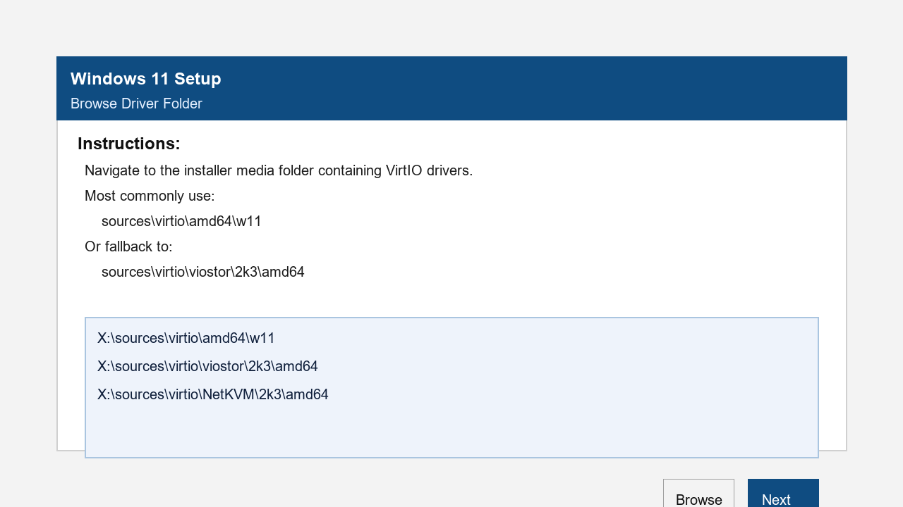

# install-windows-11-from-rescue-for-contabo

Automated script and instructions to install Windows 11 on a Contabo VPS from the rescue system, with VirtIO drivers and registry bypass for TPM, RAM, and Secure Boot checks.

## Features
- Fully automated disk partitioning and formatting
- Downloads and prepares the official Windows 11 evaluation ISO
- Integrates VirtIO drivers for disk and network support
- Adds registry and batch files to bypass Windows 11 hardware checks (TPM, RAM, Secure Boot)
- Can be used with any QEMU-based rescue system that supports our target rescue-spec setup, including pulling the ISO directly if needed

## Prerequisites
- Contabo VPS (any plan)
- Access to the Contabo control panel
- VNC Viewer (e.g., RealVNC)
- SSH client (e.g., PuTTY, Terminal)

## Usage Instructions

### 1. Boot VPS into Rescue System
1. In the Contabo control panel, select your VPS and choose **Rescue System** (Debian/Ubuntu Live recommended).
2. Set a password and reboot into rescue mode.

### 2. Connect via SSH
1. SSH into your VPS using the rescue system credentials:
   ```
   ssh root@<VPS-IP>
   ```

### 3. Download and Run the Script
1. Update package metadata and install git if needed:
   ```
   apt update -y
   apt install git -y
   ```
2. Clone this repository:
   ```
   git clone https://github.com/WebWire-NL/install-windows-11-from-rescue-for-contabo.git
   cd install-windows-11-from-rescue-for-contabo
   ```
3. Make the script executable and run it:
   ```
   chmod +x windows-install.sh
   bash windows-install.sh
   ```
   If the rescue shell does not honor the script shebang or executable flag, run it explicitly with bash:
   ```
   bash windows-install.sh
   ```

#### Command-line arguments
The installer now supports explicit CLI arguments instead of environment variables:
- `--windows-iso-url <url>` — specify the Windows ISO download URL.
- `--virtio-iso-url <url>` — specify the VirtIO driver ISO download URL.
- `--no-prompt` — run non-interactively and avoid prompting for input.
- `--force-download` — force redownload of ISOs and installer media even if files already exist.
- `--check-only` — run only the preflight compatibility/rescue checks.
- `--recreate-disk` — force disk recreation on the next run.

Example:
```bash
bash windows-install.sh --no-prompt --windows-iso-url "<windows-iso-url>" --virtio-iso-url "<virtio-iso-url>"
```

4. The script will partition the disk, download Windows 11 and VirtIO drivers, and prepare everything. The VPS will reboot when done.

### 5. Complete Windows 11 Installation via VNC
1. In the Contabo panel, get your VNC connection info and connect with VNC Viewer.
2. Proceed with Windows 11 setup.
3. When you reach the first setup screen, choose **Load driver** before selecting a disk.
   - Browse the available drives for the installation media that contains the `sources\virtio` folder.
   - In most cases, WinPE will show the installer media drive as `X:` or another drive letter.
   - Select the driver path from the installer media, for example:
     `X:\sources\virtio\amd64\w11`
   - Choose the VirtIO SCSI driver file `vioscsi.inf` for a SCSI controller.
   - If that does not work, try the alternate storage driver `viostor.inf` from:
     `X:\sources\virtio\viostor\2k3\amd64`
   - Once the correct driver is loaded, the disk should appear in the installer.

   

4. Once the storage driver is loaded, the installer should show your target disk.
   - If you are installing Windows to the first partition, delete and recreate that partition inside the installer before installing.
5. If you need to apply bypass files, press `Shift+F10` to open Command Prompt and run:
   ```cmd
   cd <installer-drive-letter>:\sources
   bypass.cmd
   ```

   - `X:` is the WinPE boot drive and usually does not contain the installer media.
   - The installer media is often mounted as `C:`, `D:`, or another letter in WinPE.
   - If you do not see `bypass.cmd` on `X:`, switch to the drive that contains `sources\virtio` and run bypass from there.
   - In this setup, the bypass file is located at `D:\sources\bypass.cmd` on the installer media.
   - Use `diskpart` only after the correct media volume is visible and drivers are loaded.
6. Close the Command Prompt and continue with the installation.
7. If Windows asks for additional drivers, browse again to the same `virtio` folder on the installer media and load the correct driver.
8. Continue the standard Windows installation.

## Notes
- The script uses the official Windows 11 evaluation ISO. You can change the ISO URL in the script if needed.
- The registry and batch files are placed in the installation media's `sources` folder for easy access during setup.
- This process will erase all data on the VPS disk.

## Troubleshooting
- If you encounter issues with drivers, ensure you select the correct VirtIO drivers from the `virtio` folder during Windows setup.
- If the Windows installer does not see your disk, load the storage drivers from the same folder.

## Disclaimer
Use at your own risk. This script is provided as-is and is not affiliated with Contabo or Microsoft.
